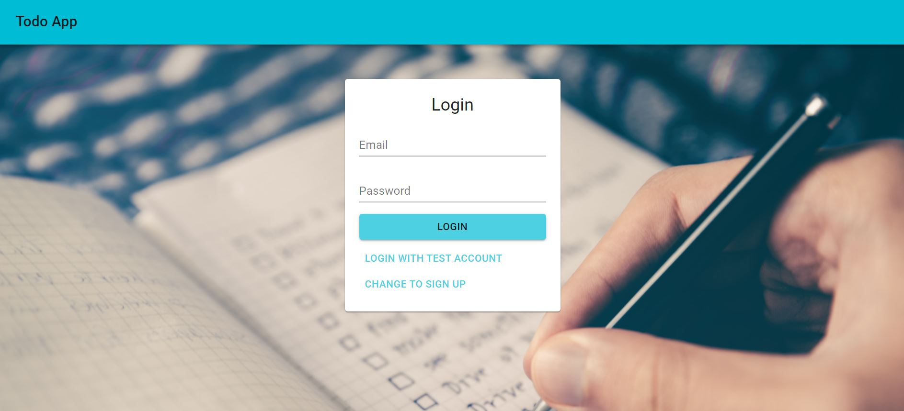
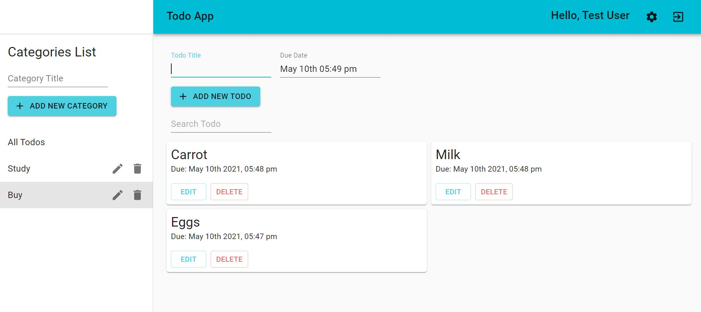
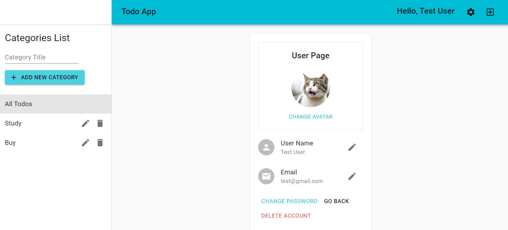

# Todo App
A fancy todo app which allows you to manage your task efficiently. Your todo can be stored in each category you set.

---
## URL
https://useful-todo-app.herokuapp.com/
You can login as a test user below
(If you use this account, some todos might be already registered, and user information cannot be changed)
```
email: test@gmail.com
password: 123456
```
or register as a new user to use the app, of course!

## Examples
#### Landing Page


#### Main Page


#### Account Page


## Getting Started
- copy this project into your local machine
- install npm
```
npm install 
```
- launch app
```
npm run dev
```

## Tech Used
- React
- Redux
- React-hook-form
- Material-UI
- Node.js
- Express
- MongoDB
- Mongoose
- JsonWebToken
- Cloudinary
- Jest
- React Testing Library

## Author
Takuto Okamoto

## License
[MIT](https://choosealicense.com/licenses/mit/)